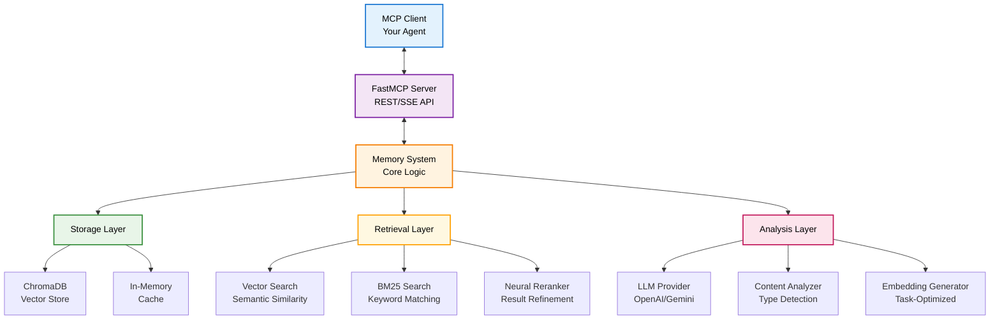

# AMemCP - Agentic Memory System via Model Context Protocol

An agentic memory system that provides persistent storage and semantic search capabilities for AI agents, exposed through the Model Context Protocol (MCP) for seamless integration with modern AI workflows.

## 🎯 Overview

AMemCP combines advanced memory management with intelligent content analysis to create a powerful memory system for AI agents. It features:

- **Intelligent Content Analysis**: LLM-powered content classification and metadata extraction
- **Hybrid Retrieval**: Combines vector embeddings with keyword-based search (BM25)
- **Advanced Reranking**: Uses state-of-the-art rerankers for improved search quality
- **MCP Integration**: Full Model Context Protocol support for agent ecosystems
- **Multi-Provider Support**: Works with OpenAI, Google Gemini, and other LLM providers
- **Async-First Design**: Built for high-performance concurrent operations

## 🏗️ Architecture



## 🚀 Quick Start

### Prerequisites

- Python 3.8+
- API key for your chosen LLM provider (OpenAI or Google)

### Installation

```bash
# Clone the repository
git clone https://github.com/yourusername/AMemCP
cd AMemCP

# Install dependencies
pip install -r requirements.txt

# Set up environment variables
cp .env.example .env
# Edit .env with your API keys and configuration
```

### Basic Server Setup

```bash
# Set your API key
export GOOGLE_API_KEY="your-api-key-here"
# or
export OPENAI_API_KEY="your-api-key-here"

# Run the server
python run_server.py
```

The server will start at `http://localhost:8010` by default.

### Environment Configuration

Key environment variables:

```bash
# LLM Configuration
LLM_BACKEND=gemini          # or "openai"
LLM_MODEL=gemini-2.5-flash-preview-05-20
EMBED_MODEL=gemini-embedding-exp-03-07
GOOGLE_API_KEY=your-key-here

# Server Configuration
FASTMCP_HOST=0.0.0.0
FASTMCP_PORT=8010
PROJECT_NAME=my-project

# Features
ENABLE_LLM_ANALYSIS=true
ENABLE_AUTO_SEGMENTATION=false
RERANKER_MODEL=jinaai/jina-reranker-v2-base-multilingual

# Storage
PERSIST_DIRECTORY=./data/chroma_db
LOAD_EXISTING_ON_STARTUP=true
```

## 📖 Usage

### MCP Client Integration

```typescript
// TypeScript/JavaScript
import { Client } from '@modelcontextprotocol/sdk/client/index.js';
import { SSEClientTransport } from '@modelcontextprotocol/sdk/client/sse.js';

const transport = new SSEClientTransport(
  new URL('http://localhost:8010/sse')
);
const client = new Client({ name: "my-agent", version: "1.0.0" }, {
  capabilities: { tools: {} }
});

await client.connect(transport);
```

### Direct Python Usage

```python
from amem.core.memory_system import AgenticMemorySystem, AgenticMemorySystemConfig
from amem.core.llm_controller import LLMController

# Initialize components
llm_controller = LLMController(
    backend="gemini",  # or "openai"
    api_key="your-api-key"
)

# Create memory system
memory_system = AgenticMemorySystem(
    # ... (see examples/ directory for complete setup)
)

await memory_system.initialize()

# Create a memory
note = await memory_system.create(
    "The Eiffel Tower is 330 meters tall and located in Paris.",
    name="Eiffel Tower Facts"
)

# Search memories
results = await memory_system.search("famous towers", k=5)
```

## 🔧 Available MCP Tools

| Tool | Description | Parameters |
|------|-------------|------------|
| `create_memory` | Create a new memory note | `content`, `name?`, `metadata?` |
| `get_memory` | Retrieve a memory by ID | `memory_id` |
| `update_memory` | Update existing memory | `memory_id`, `content?`, `metadata?` |
| `delete_memory` | Delete a memory | `memory_id` |
| `search_memories` | Semantic search across memories | `query`, `top_k?`, `use_reranker?` |
| `get_all_memories` | Retrieve all stored memories | None |
| `get_memory_stats` | Get system statistics | None |
| `health_check` | Check server health | None |

## 🧠 Core Features

### Intelligent Content Analysis

AMemCP automatically analyzes content to:
- Extract keywords and generate summaries
- Detect content type (code, documentation, questions, etc.)
- Determine optimal embedding strategies
- Assess importance and sentiment

### Hybrid Search

Combines multiple retrieval methods:
- **Vector Search**: Semantic similarity using embeddings
- **Keyword Search**: BM25-based lexical matching
- **Reranking**: Advanced reranking models for result refinement

### Task-Optimized Embeddings

Supports specialized embedding types for different content:
- `RETRIEVAL_DOCUMENT`: For storing general documents
- `RETRIEVAL_QUERY`: For search queries
- `CODE_RETRIEVAL_QUERY`: For code-related searches
- `QUESTION_ANSWERING`: For Q&A applications

## 📁 Project Structure

```
amem/
├── core/                 # Core memory system logic
│   ├── memory_system.py  # Main AgenticMemorySystem class
│   ├── llm_controller.py # LLM provider abstraction
│   ├── llm_providers.py  # OpenAI/Gemini implementations
│   ├── interfaces.py     # Core interfaces and types
│   ├── models/          # Data models (MemoryNote, etc.)
│   ├── stores/          # Storage backends (ChromaDB)
│   ├── retrievers/      # Search implementations
│   └── rerankers/       # Reranking models
├── server/              # MCP server implementation
│   └── mcp_fastmcp_server.py
├── utils/               # Shared utilities
│   └── utils.py
└── retrieval/           # Legacy retrieval (deprecated)

client/                  # TypeScript MCP client
examples/               # Usage examples
tests/                  # Test suite
```

## 🔍 Examples

The `examples/` directory contains comprehensive demonstrations of AMemCP functionality. See [`examples/README.md`](examples/README.md) for detailed documentation and usage instructions.

Quick start:
```bash
export GOOGLE_API_KEY="your-api-key-here"
python examples/gemini_example.py
```

## 🧪 Testing

```bash
# Run the test suite
pytest tests/

# Run specific tests
pytest tests/test_memory_system.py -v
```

## 🐳 Docker Support

```bash
# Build the container
docker-compose build

# Run the server
docker-compose up
```

## 🤝 Contributing

1. Fork the repository
2. Create a feature branch (`git checkout -b feature/amazing-feature`)
3. Commit your changes (`git commit -m 'Add amazing feature'`)
4. Push to the branch (`git push origin feature/amazing-feature`)
5. Open a Pull Request

## 📄 License

This project is licensed under the MIT License - see the [LICENSE](LICENSE) file for details.

## 🙏 Acknowledgments

- Built on top of [ChromaDB](https://www.trychroma.com/) for vector storage
- Uses [FastMCP](https://github.com/jlowin/fastmcp) for MCP server implementation
- Integrates with [Model Context Protocol](https://modelcontextprotocol.io/)
- Powered by state-of-the-art LLM providers (OpenAI, Google Gemini)
